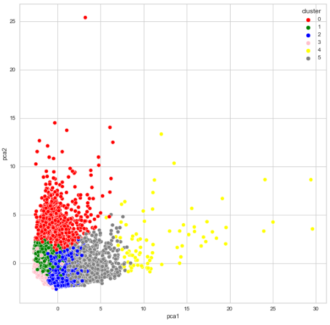

# Segmentação de clientes - cartão de crédito
Este repositório contém script para fazer uma segmentação de clientes para definir a estratégia de marketing

 

# _Objetivo do projeto_

Desenvolver uma segmentação de clientes com base no comportamento de compras.

 

# _1. Problema de Negócio_

Hoje sabemos que é de fundamental importância segmentar os nossos clientes para saber qual o padrão de consumo de cada um, e saber quais clientes estão mais propensos a comprar determinados tipos e marcas de produtos.
Um dos pontos cruciais de marketing é conhecer os clientes e identificar suas necessidades e entendendo os consumidores podemos enviar campanhas específicas para necessidades específicas e se dados sobre os clientes estão disponíveis, podemos aplicar Ciência de Dados para segmentar o mercado.

Fonte: https://www.kaggle.com/arjunbhasin2013/ccdata

 

# _2. Justificativa_

- **Por quê:** A implementação desse projeto é importante porque segmentar clientes é essencial para o sucesso de qualquer estratégia de marketing. Ao entender melhor as preferências e necessidades de cada segmento de clientes, é possível personalizar campanhas de marketing, aumentando a eficácia da comunicação e a probabilidade de conversão em vendas. Além disso, a segmentação permite que a empresa direcione seus esforços e recursos para os clientes mais valiosos e com maior potencial de retorno financeiro, maximizando o ROI (Retorno Sobre Investimento) das campanhas de marketing.
- **Como:** Para implementar esse projeto, é necessário coletar e analisar os dados dos clientes, identificar padrões e características comuns, e utilizar técnicas de Ciência de Dados, como análise de cluster, árvore de decisão, regressão logística e redes neurais, para segmentar os clientes em grupos com características similares. Com base na segmentação, a empresa pode desenvolver campanhas de marketing personalizadas para cada segmento, direcionando suas ações e investimentos para os clientes com maior potencial de retorno financeiro.
- **O quê:** O projeto consiste em segmentar os clientes com base em suas preferências e histórico de compras, utilizando técnicas de Ciência de Dados como análise de cluster, árvore de decisão, regressão logística e redes neurais. A entrega será um relatório detalhado com as segmentações de clientes e recomendações de estratégias de marketing personalizadas para cada segmento, permitindo que a empresa direcione seus esforços e recursos para os clientes mais valiosos e com maior potencial de retorno financeiro.

 

# _3. Premissas_

O conjunto de dados de amostra resume o comportamento de uso de cerca de 9.000 portadores de cartão de crédito ativos durante os últimos 6 meses.

As variáveis originais do conjuto de dados são: 

Variável | Definição
------------ | -------------
CUSTID | Identificação do cliente|
BALANCE | Saldo para fazer compras (saldo na conta corrente)|
BALANCE_FREQUENCY | Frequência que o saldo é atualizado (1 = frequente, 0 = não frequente) |
PURCHASES | Quantidade de compras realizadas|
ONEOFFPURCHASES | Quantidade de compras feitas “de uma só vez”|
INSTALLMENTS_PURCHASES | Quantidade de compras parceladas|
CASH_ADVANCE | Dinheiro adiantado, indica se o cliente saca do cartão de crédito|
PURCHASES_FREQUENCY | Frequência das compras (entre 1 e 0)|
ONEOFF_PURCHASES_FREQUENCY | Frequência de compras à vista (entre 1 e 0)|
PURCHASES_INSTALLMENTS_FREQUENCY | Frequência de compras parceladas (entre 1 e 0)|
CASH_ADVANCE_FREQUENCY | Frequência de saques de dinheiro adiantado|
CASH_ADVANCE_TRX | Número de transações feitas|
PURCHASES_TRX | Número de compras|
CREDIT_LIMIT | Limite do cartão de crédito|
PAYMENTS | Valor pago|
MINIMUM_PAYMENTS | Valor mínimo pago|
PRC_FULL_PAYMENT | Percentual de pagamentos da fatura “completa”|
TENURE | Posse do titular do cartão|

 

# _4. Planejamento da solução_

1. Entendimento do negócio:
  - Foi realizado a descrição do negócio.
2. Coleta dos dados:
  - Foi feito o downloand do arquivo da plataforma do Kangle.
3. Limpeza dos dados:
  - Foi realizado a Análise Descritiva dos Dados, passo importante para verificar o quanto, o projeto é desafiador, ou seja verificar a qualidade dos dados e o entendimento dos dados.
  - Também foi realizado a filtragem das variáveis relacionado nas restrições do negócio, fazendo a média para preencher os valores nulos.
4. Análise exploratória dos dados:
  - Nesta etapa foi realizado a Exploração de Dados, que serve para medir o impacto das variáveis em relação as variáveis respostas e muitas vezes quantificar este impacto, nesta etapa começa gerar valor para o entendimento do negócio.
5. Preparação dos dados:
  - Agora entramos na Modelagem dos dados, onde vamos preparar os dados para ensinar os Algoritmo de Machine learning, passo importante, porque o aprendizado da maioria dos algoritmos de ML é facilitado com dados numéricos e na mesma escala.
  - Vamos usar o Algoritmo K-Means, então devemos definir do número de clusters de acordo com a base de dados e foi usado Elbow Method, que é chamado do método do cotovelo.
6. Treinamento algoritmos de machine learning:
  - Nesta etapa vamos implementar os Algoritmos de Machine Learning, e escolher o que tem mais performance e seguir com ele para a produção.
7. Avaliação do algoritmo:
    - Nesta etapa é a oportunidade de responder: Qual seria o impacto deste resultado no negócio?
    - Dependendo da resposta podemos colocar em produção e deixar o time de negócio usar ou voltar e melhorar alguns pontos.
    - E para avaliar foi feito a aplicação de PCA (principal component analysis) é utilizado para redução de dimensionalidade, uma técnica que pode ser usada para ajudar na visualização do agrupamento.
8. Implementar o modelo para produção:
  - É a etapa em colocar em produção ou fazer uma simulação do modelo, para deixar acessível para qualquer consumidor.

 

# _5. Insights_

*Resumo dos insights durante análise exploratória de dados (EDA):*

- Separar um grupo de cliente que possuem uma tendência maior a sacar dinheiro do limite do cartão de crédito, pois assim o banco poderia aumentar o limite e os clientes poderia sacar mais dinheiro e o banco passaria a ganhar mais.
- Poderiamos separar grupos, pessoas que faz compra a vista e pessoas que faz compras a prazo, para que o banco possa enviar campanha de marketing diferentes.
- No atributo Purchases_frequency, podemos identificar dois grupos, um grupo de que usa muito o cartão de crédito e outro que praticamente não usa cartão de crédito, desta forma o banco pode análisar e mandar campanha diferente para cada perfil de cliente.

 

# _6. Modelos de Machine Learning_

1. K-Means.
2. PCA (principal component analysis)

 

# _7. Performance do Modelo de Machine Learning_

Analisando o resultado do algoritmo K-Means podemos fazer a definição do perfil dos clientes em grupos:

- Grupo 0:
  - Grupo que tem o maior saldo na conta corrente e as pessoas deste grupo vai muitas vezes ao caixa eletrônico, mas não tem o hábito de pagar a fatura completa, sendo o segundo maior grupo em pagar o mínimo da fatura e também com o maior limite do cartão de crédito.
  - Este pode ser considerado um grupo que o banco acaba ganhando bastante dinheiro, porque no uso do CASH_ADVANCE têm um juros muito alto, porém apresenta o maior risco para o banco, pórque se eles não pagam a fatura completa a tendência é que estes clientes vão endividar cada vez mais rápido e pode chegar em uma situação que eles não vão ter o dinheiro para pagar todos os estes juros para o banco.

- Grupo 4:  
  - É um grupo que realiza muitas compras e o segundo grupo com o maior saldo na conta corrente, as pessoas deste grupo tem a frequência em não parcelar as compras realizadas. Este grupo é o que tem o maior limite no cartão de crédito e também o maior em pagar em pagar a fatura completa.
  - Este grupo pode ser considerados os clientes mais importantes para o banco (VIP/Prime), podemos dizer que o banco sempre vai ganhar dinheiro com estes clientes, porque eles usam o cartão e pagam a fatura em dias. Uma estratégia que o banco pode fazer é aumentar o limite do cartão e incentivar o hábito de compras através de uma campanha de marketing.

- Grupo 5:
  - É o segundo grupo que realiza muitas compras e tem o hábito em pagar a vista as suas compras. Também podemos dizer que um dos grupos onde o banco não vai ganhar muito dinheiro através de juros.

- Grupo 1:
  - É um grupo que não realiza muitas compras, mas é o segundo maior grupo que vai muitas vezes ao caixa eletrônico.

- Grupo 2:
  - É o menor grupo que realiza compras sem parcelar e não sacam muito dinheiro do limite do cartão.

- Grupo 3:
  - É um grupo que possui menos dinheiro na conta corrente e o menor grupo que paga o mínimo do cartão de crédito.

  

  
  

   

# _8. Conclusão_

O objetivo do projeto era fazer uma análise das vendas e do comportamento dos clientes. Com as features existentes no dataset foi possível segmentar os clientes, para o departamento de Marketing e agora se torna possível enviar campanhas específicas para necessidades específicas dependendo do tipo de cliente.

 

# _9. Próximos passos_
Aplicação de autoencoders que são um tipo de redes neurais artificiais para codificar dados, uma forma alternativa para a aplicação do PCA.
